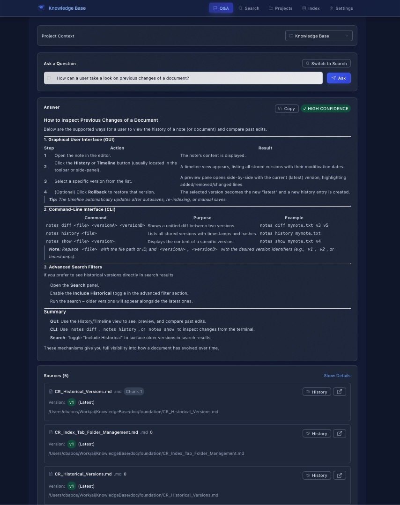

Like many of you, I’m feeling a bit overexposed to AI. It’s everywhere — every company, including mine, is trying to adopt it or even bet its future on it.  
The overall goal sounds noble: make our work more efficient, reduce boilerplate, and let us focus on real problems instead of endless “nuisance” tasks.  
There’s an AI for that, right?  

No matter how long you’ve been developing, AI is changing everything. And if you think it’s going away soon… well, I’m not saying you’re wrong — but there’s no real sign of that yet.

---

## The Plan
I wanted to build a project that actually made sense as a personal experiment. Imagine having tons of documentation — notes, mind maps, project files — and needing to quickly find relevant information later.  

Sure, plenty of tools already exist for that. One I really like is [Obsidian](https://obsidian.md). It stores everything as Markdown files, then links them through metadata and references to create a real knowledge base.  

Nice! But of course, there’s always more to desire.  

What if your documentation could also help you *write*? Like generating a release note, a marketing post, or even a tweet (or whatever they call it on X now). For people like me — not exactly born writers — a tool like that could save hours of painful writing.  

So here’s the plan:  
A local knowledge base app that indexes files from project folders (multi-project support is a must) and provides an LLM assistant to extract and highlight relevant information from them.  
After all, what’s more satisfying than writing a software’s release notes *inside* the software itself?

---

## Creating Requirements
I’m terrible at defining details — which is exactly why I have my trusty AI sidekick, ChatGPT.  

My idea was simple: have it act as the *client*, writing business requirements in Markdown. Then, as a *Business Analyst*, it would generate the appropriate epics and user stories so a developer could actually understand the goals.  

I only reviewed a few user stories before deciding to just *yolo* it.  

Now imagine you’re the developer (why else would you be reading this?). You get your requirements and user stories in Markdown, pick tasks, and implement them.  
But what if *you* were replaced by AI?  

I’d already played with Cursor a bit, and since I had unlimited usage for a short period, I decided to go all in.

---

## The First Prompt
I’m not kidding — one prompt, an 8-minute wait, and the hope that something usable would come out of it. That’s the new definition of insanity.  
[And I was insane.](https://github.com/cbabos/KnowledgeBase/commit/5a46ed3d97b29233c9701803735880f62d4a6559)

I even decided to make the backend in Rust — a language I had *never* touched before. Of course, it didn’t compile. At all.  

But surprisingly, the generated code wasn’t bad. So as my second prompt, I asked Cursor to fix the compilation issues and start testing the functionality. That kicked off a 30+ minute process with zero human intervention.  

When it was done — the code compiled, the app started, and everything looked promising.

---

## First Experiences
At that point, I had a working app: a Rust backend, SQLite database, and React frontend — all in a neat little package. I hadn’t touched a single line of code.  

In about an hour, I had something that would normally take days (especially since I’d never used Rust before). 

That’s when it hit me: I wasn’t a *developer* anymore — I was a *client* asking for development.  

Then came the second realization: I still had to test everything.  

Was it all working?  
Yes and no.  

Cursor can follow a big plan and execute based on context — but that context fills up fast. After about 38 minutes, it started summarizing and rewriting its own understanding, inevitably losing details.  

This was a key learning moment:  
> **LLMs can’t deliver large, single-prompt applications.**  
> As the “manager,” you have to break the work into smaller, well-defined tasks — just like a real team lead would.  

Too much context equals confusion, and things get forgotten.  

> **Key takeaway:** Use separate chat sessions for manageable tasks. Provide only the necessary context. Cursor will automatically pull in related code and documentation when needed.

I tried this approach in a later experiment, and it worked beautifully. But more on that in another post.

---

## Checking the Code
Since I barely know Rust, I focused more on the frontend.  

The generated app used Tailwind and — to my surprise — Create React App (which feels like a relic at this point).  

So, I asked Cursor to convert everything to Vite, and then from Tailwind to CSS Modules.  
This turned into several frustrating hours. Cursor often claimed the job was done while missing entire parts. No matter what I tried, I kept finding leftover Tailwind code.  

Eventually, persistence paid off and the migration was complete — but next time, I’ll specify the tech stack *from the start*.

> **Key takeaway:** Define your technology stack in detail early on. It saves a lot of pain later.

---

## Rules
Around this time, I stumbled across a podcast mentioning Cursor *Rules*.  

For context: I use Cursor as a fully automated agent — no permission prompts. I’m comfortable reviewing results myself and reverting bad changes if needed.  

So, before bed, I’d often queue a task, leave it running overnight, and wake up to see progress. It felt oddly like having a colleague who works while I sleep.  

But then I made one mistake: one of my prompts asked it to commit changes. From that moment on, it *always* committed automatically.  
And of course, it committed code that didn’t even compile.  

That’s when I realized I needed **Rules** — specifically to prevent commits unless I explicitly requested them.  

If you haven’t already, check out the [Cursor Rules documentation](https://cursor.com/docs/context/rules).  

I’ll probably write another post focused just on Rules. I don’t think I’m using them to their full potential yet, but I already see their value. With well-defined rules, Cursor could handle testing, building, and validation much more reliably — something I still had to repeat manually each time.

---

## Conclusion
After about four days of work (well, three — most of it happened between play sessions with my daughter), I had a product that could:

- Create, edit, and delete projects  
- Index local files from specific folders  
- Version the indexed files  
- Search within them  
- Use Ollama as an LLM source to generate extracts or new documents based on the indexed knowledge  

As a bonus, it even implemented version diffs — something I don’t remember ever asking for.  

The experience? Honestly, wild.  
It’s amazing what you can accomplish in such a short time. Even more amazing when you realize 60–80% of that time was spent debugging or clarifying misunderstandings.  

With the right setup, rules, and prompts, I’m convinced tools like Cursor can do much more.  

Will AI replace software developers?  
No. Not yet.  

Should we adapt and learn to work with LLMs?  
Absolutely, yes.  

Will software development change?  
Without question.  
Even today, LLMs can generate usable code faster than most humans — but they still need guidance.  
That’s where we come in. Our role is changing, and it’s up to us to figure out *how*.

---
